# Professional Certifications & Education

A collection of my professional certifications, education and completed courses in project management, AI, cloud technology, and more.

## Education
M.S. Information Systems - University of Maryland, Baltimore County
Graduate degree in Information Systems earned from UMBC's Graduate School. This program provided comprehensive knowledge in designing, implementing, and managing information systems to solve complex business and organizational challenges.

## Project Management

### Project Management for Government Projects
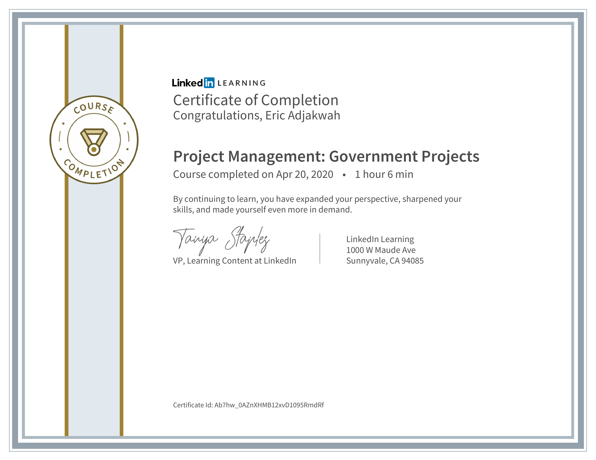

Training focused on specialized methodologies and compliance requirements for managing government-sector projects, including federal acquisition regulations, stakeholder management, and public sector budget constraints.

### Agile Project Management
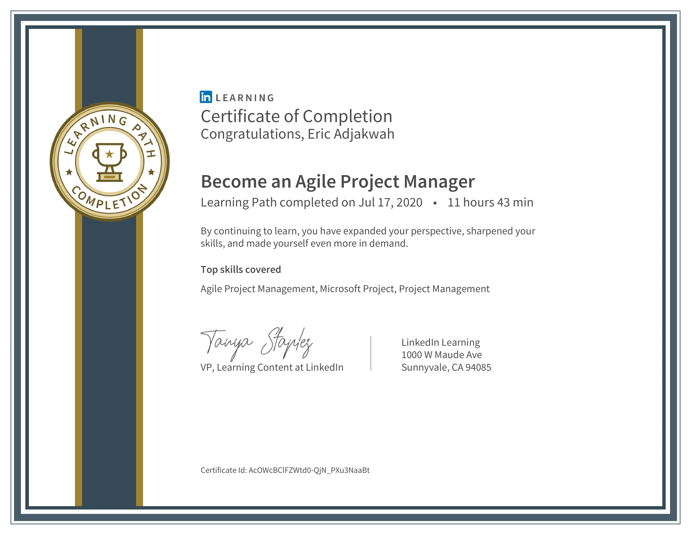

Comprehensive training in Agile methodologies, covering Scrum, Kanban, and other frameworks for iterative project delivery, sprint planning, retrospectives, and adaptive project management.

### Google Project Management Certification
[Google Project Management Certificate](./docs/google-pm.pdf)

Industry-recognized credential covering foundational project management skills, Agile and Scrum methodologies, risk management, and team leadership according to Google's project management best practices.

### FAC COR II Certification
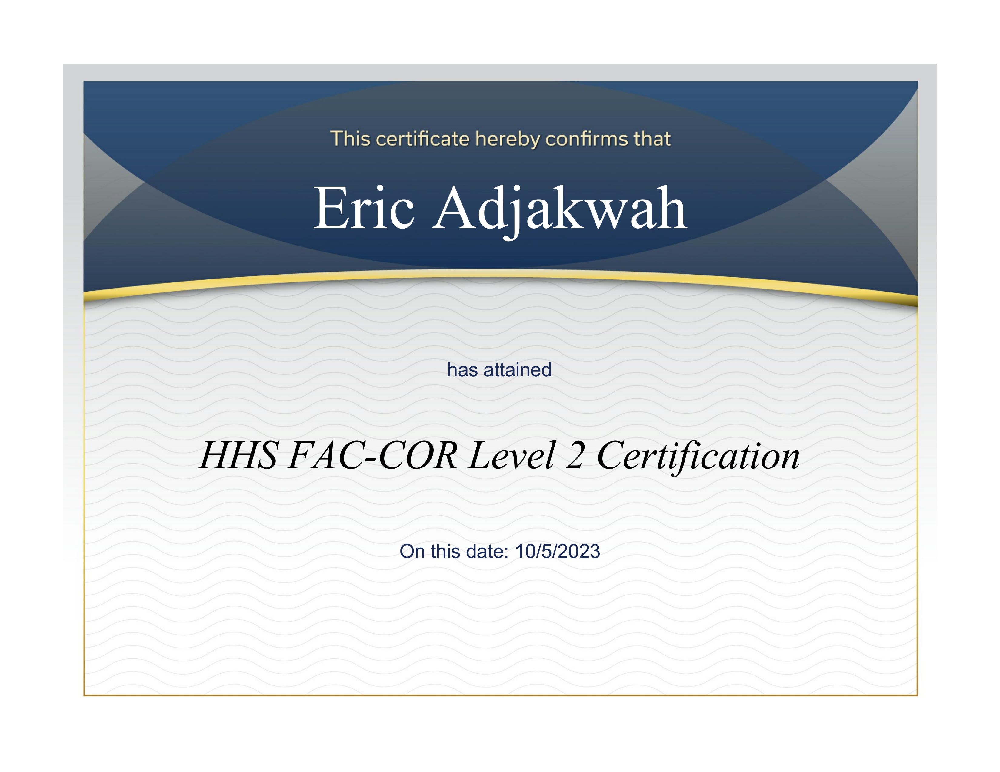

Federal Acquisition Certification for Contracting Officer's Representatives (Level II), qualifying for management of government contracts.

## Web Development

### WordPress Website Development
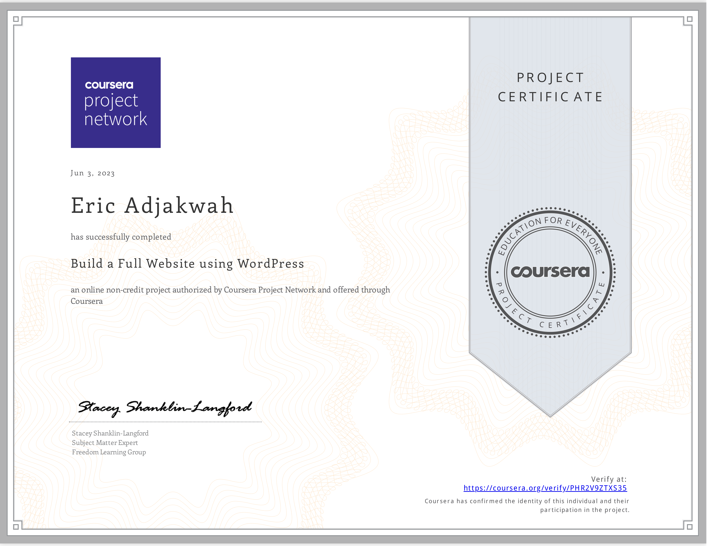

Skills in building full-featured websites using WordPress, including theme customization, plugin integration, content management systems, and responsive design principles.

## Business Analysis

### Business Analysis Foundations
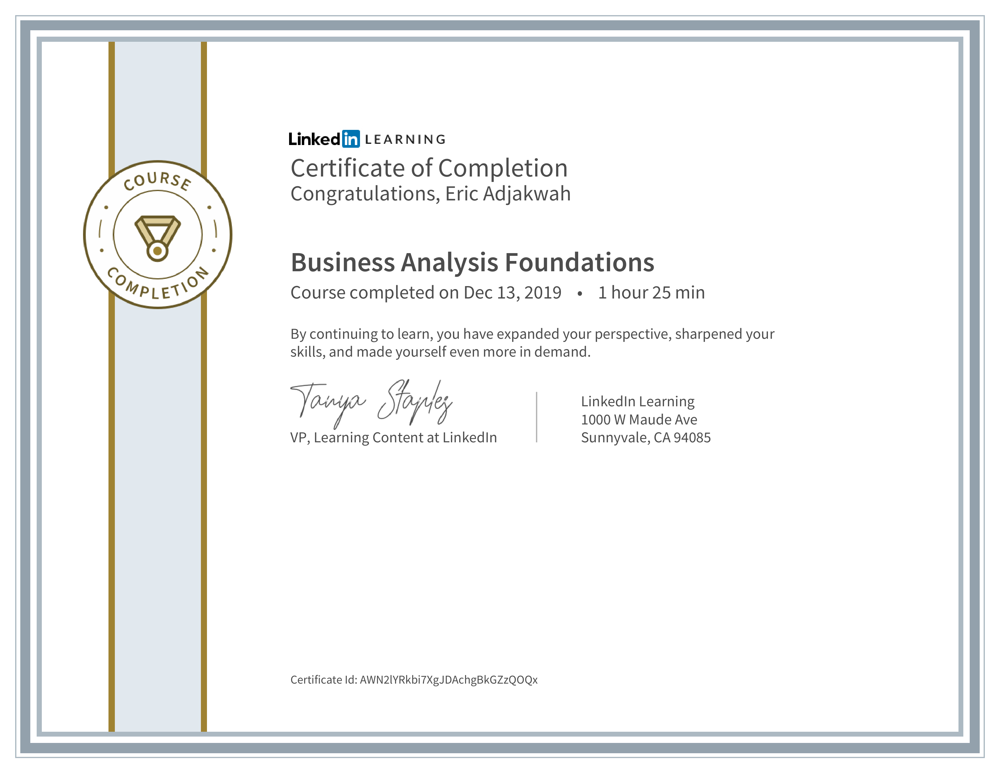

Core concepts of business analysis including requirements gathering, process modeling, stakeholder analysis, and solution assessment for improving business processes and outcomes.

## AI and Machine Learning

### CREWAi Multi Agent Certification
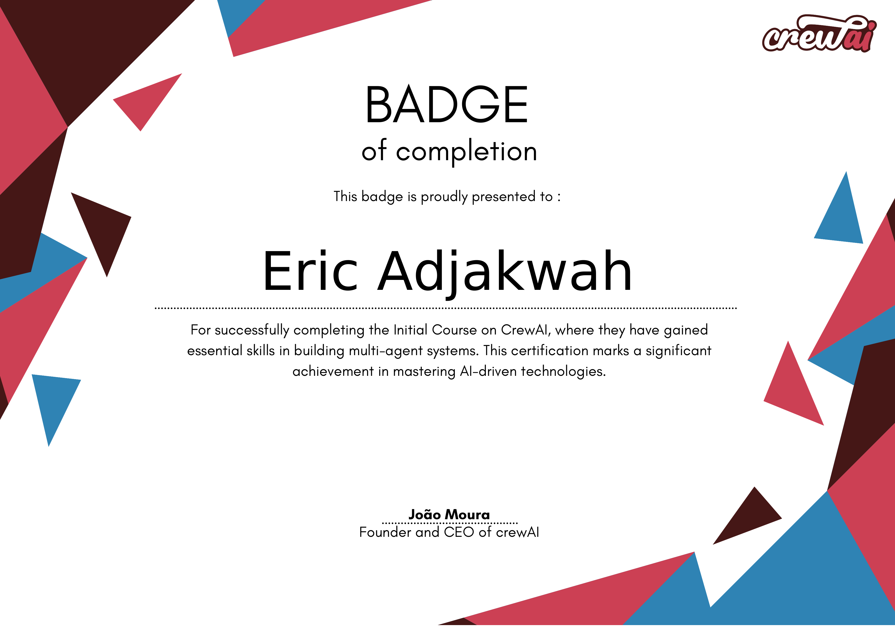

Specialized training in designing and implementing multi-agent AI systems using the CREWAi framework for autonomous agent collaboration and complex task execution.

### AWS AI Certification (Amazon Bedrock)
[AWS AI Certificate](./docs/aws-ai.pdf)

Amazon Web Services credential validating expertise in implementing AI/ML solutions on AWS, including SageMaker, Rekognition, Comprehend, and other AWS AI services. Strategic frameworks for implementing generative AI solutions within organizations, covering change management, infrastructure requirements, and ethical considerations. Methodology for scoping, planning, and executing generative AI projects, including use case identification, data requirements, and performance measurement. Technical training in developing applications powered by generative AI, covering large language models, prompt engineering, and application architecture. Techniques for effective prompt design and optimization for generative AI systems, including context design, few-shot prompting, and chain-of-thought techniques.

### AI for Product Management
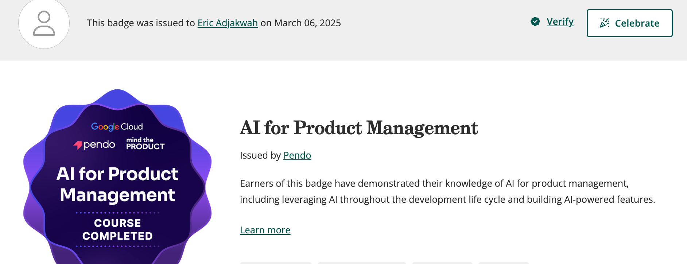

This certification demonstrates expertise in integrating AI into product management practices. It covers leveraging artificial intelligence throughout the product development lifecycle, from ideation to deployment, and building AI-powered features that enhance product capabilities. Skills gained include AI use case identification, development roadmapping for AI features, and strategies for creating AI-augmented product experiences.

## ServiceNow

### ServiceNow Basic Administration
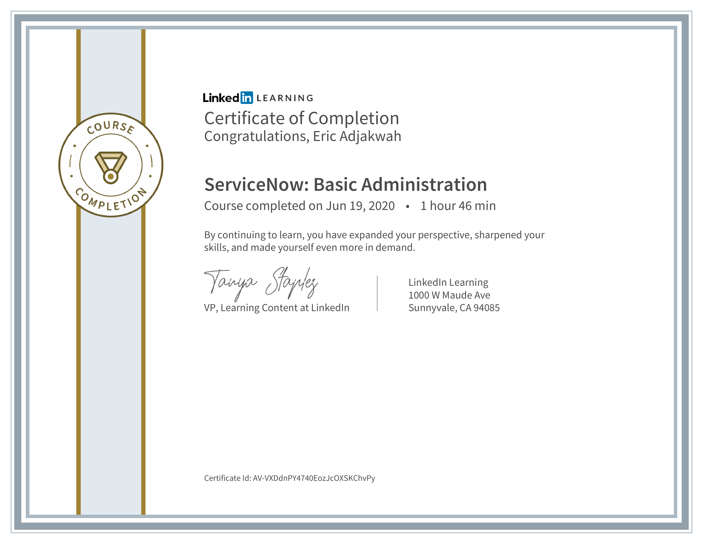

Fundamental skills in administering ServiceNow instances, including user management, form customization, workflow automation, and service catalog configuration.

### Learning ServiceNow
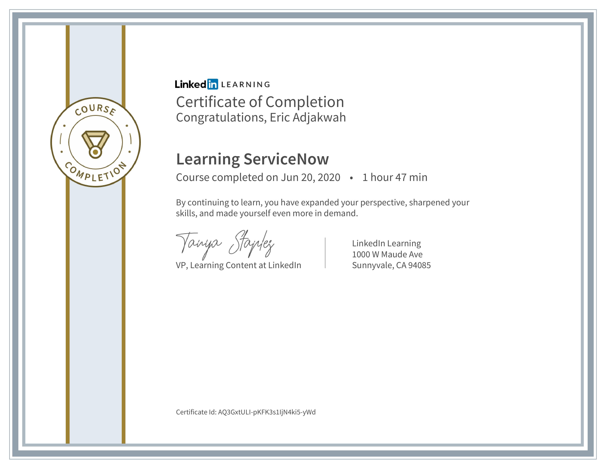

Introduction to the ServiceNow platform capabilities, including IT Service Management (ITSM), IT Operations Management (ITOM), and application development.

## SharePoint

### SharePoint Workflow Automation with Nintex
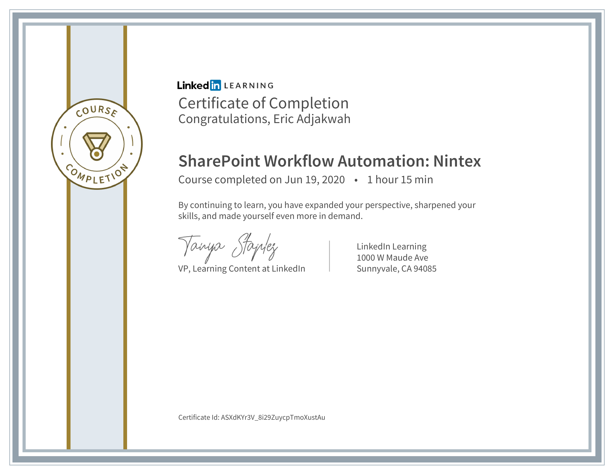

Advanced techniques for automating business processes in SharePoint using Nintex workflow tools, including form design, workflow actions, and integration points.

### SharePoint 2013 Microsoft Office Specialist
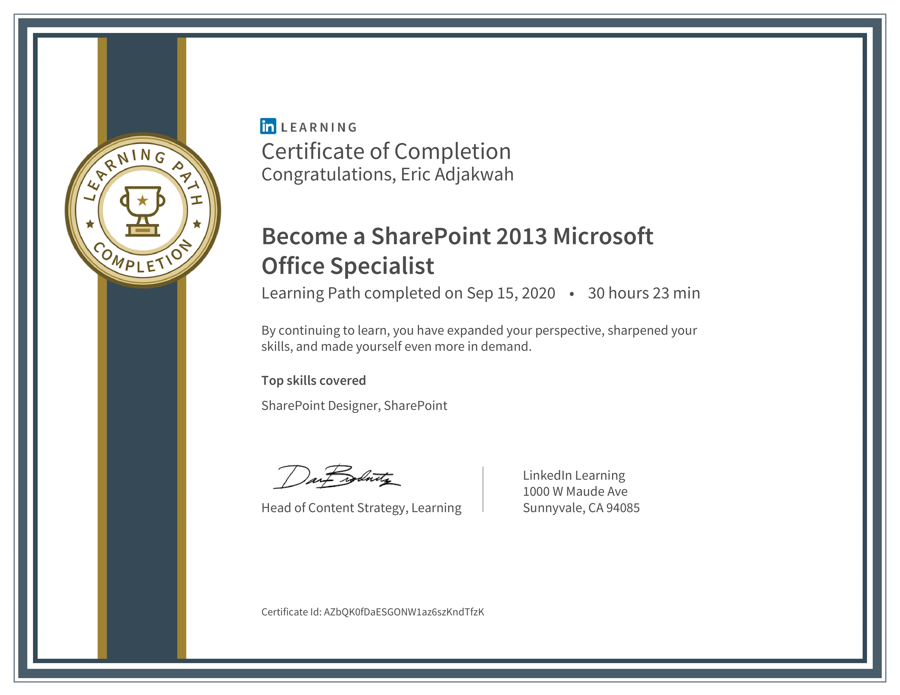

Microsoft Office Specialist certification validating expertise in SharePoint 2013 site creation, content management, user permissions, and integration with Office applications.
